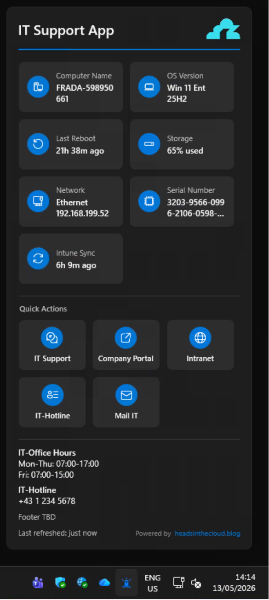

# TrayLight

> A lightweight Windows System Tray app that gives end users instant access
> to device info, IT support shortcuts, and Intune sync — branded for your
> organization and configured entirely through Group Policy / Intune.

[](https://github.com/daniel-fraubaum/TrayLight/releases/latest)
[](https://github.com/daniel-fraubaum/TrayLight/actions/workflows/build.yml)
[](LICENSE)



## Features

- System Tray icon with a modern Windows 11 Fluent Design popup
- Tray-icon state swap: shows a warning variant
  (`Assets/app-warning.ico`) whenever any info tile reports a real warning,
  otherwise the normal icon (`Assets/app-normal.ico`)
- **Default info tiles** (always shown, six in total):
  - **Computer Name** — click to copy
  - **OS Version** — informational
  - **Last Reboot** — uptime; warns when above the configured day limit
  - **Storage Usage** — system drive %; warns at the configured threshold
  - **Serial Number** — hardware serial via WMI (with VM detection); click to copy
  - **Intune Sync** — time since last MDM check-in; click to trigger a sync
- **Additional tiles available via ADMX** (not enabled by default):
  - **Network Info** — active SSID/Ethernet + IPv4
  - **Entra ID Status** — join state from `dsregcmd /status`
  - **Intune Compliance** — enrollment status
- Up to **6 configurable Quick Action shortcut buttons** (URL / App / Command),
  each with its own title, subtitle, icon and position via ADMX
- **Customizable info text block** under the Quick Actions — show office
  hours, helpdesk hotline, on-call info, etc. Tiny inline markup
  (`*bold*`, `|` line break, `||` blank line) configured via a single
  ADMX policy.
- Toast notifications for warnings raised by info tiles
- Light / Dark theme follows the Windows system setting
- WPF with drop-shadow on Windows 11
- Welcome screen on first launch
- "Copy system info" button for helpdesk tickets
- Warnings only ever come from two scenarios: storage above threshold, or
  uptime above `Behavior\RebootWarningDays`. Everything else is purely
  informational — a fresh device produces zero warnings.

## Configuration

TrayLight works **out of the box with zero configuration** — on a fresh
device with no policy in place, it starts with sensible defaults
("IT Support" title, the `#0078D4` accent color, and the six default tiles
listed above). Customization is optional and pushed via **Intune Settings
Catalog** (or Group Policy) using the bundled ADMX/ADML templates.

The MSI registers an HKLM `Run` key so TrayLight launches automatically on
every user logon. Admins can disable this without uninstalling by setting
`Behavior\AutoStart = 0` in policy — the process then exits immediately on
startup.

- Registry root: `HKLM\SOFTWARE\Policies\TrayLight\`
- Templates: [`config/admx/TrayLight.admx`](config/admx/TrayLight.admx) and [`config/admx/en-US/TrayLight.adml`](config/admx/en-US/TrayLight.adml)
- Reference: [`config/admx/README.md`](config/admx/README.md)

For the full Intune walkthrough see [`docs/INTUNE-DEPLOYMENT.md`](docs/INTUNE-DEPLOYMENT.md).

### Customer logo

The `Branding\Logo` policy accepts either a URL or a local file path:

- **Option A — URL (easiest):** set `Logo = https://corp.example.com/logo.png`
  via Intune. TrayLight downloads it to
  `%ProgramData%\TrayLight\Cache\logo.png` and refreshes once a day. If the
  download fails the previously cached copy is used.
- **Option B — Bundled file (offline / airgapped):** drop a `logo.png` into
  `src/TrayLight/Assets/` before building the MSI; it ships inside the
  package and is installed to `C:\Program Files\TrayLight\Assets\logo.png`.
  Set `Logo = C:\Program Files\TrayLight\Assets\logo.png` in policy.

## Tray icon visibility

After installation, the TrayLight icon may appear in the taskbar overflow
area (the `^` arrow). To keep it permanently visible, drag the icon from
the overflow onto the main taskbar. This is a one-time action per user —
Windows remembers the preference. This is a Windows limitation that
affects all system tray applications and cannot be controlled via policy.

## Getting Started

**Prerequisites**

- .NET 8 SDK (with the *Windows Desktop* workload)
- Windows 11 SDK `10.0.26100`

**Build & run**

```pwsh
git clone https://github.com/daniel-fraubaum/TrayLight.git
cd TrayLight
dotnet restore TrayLight.sln
dotnet build   TrayLight.sln -c Debug
dotnet run --project src/TrayLight/TrayLight.csproj
```

**Build the MSI locally**

```pwsh
dotnet build src/TrayLight.Installer/TrayLight.Installer.wixproj -c Release
# → src/TrayLight.Installer/bin/x64/Release/TrayLight.msi
```

> CI/CD on GitHub Actions builds the MSI automatically on every tagged
> release (`v*`) and attaches `TrayLight-vX.Y.Z.msi` to the GitHub Release.

**Installation**

> The MSI is **self-contained** — it ships with its own .NET 8 runtime, so
> no .NET installation is required on the target machine. The package size
> is roughly 70 MB as a result.

- **Manual (interactive):** double-click `TrayLight.msi` to launch the setup
  wizard. The install directory defaults to `C:\Program Files\TrayLight\`.
  The final page offers a *Launch TrayLight* checkbox.
- **Silent (e.g. for Intune / scripted rollout):**
  ```pwsh
  msiexec /i TrayLight.msi /qn
  ```
- **Uninstall:**
  ```pwsh
  msiexec /x {2493D886-5C60-45E0-95BE-7F450BE2C2FC} /qn
  ```

## Deployment

See [`docs/INTUNE-DEPLOYMENT.md`](docs/INTUNE-DEPLOYMENT.md) for:

- Uploading the MSI to Intune as a Line-of-Business app
- Silent install / uninstall / detection rules
- Configuration via Intune Settings Catalog (ADMX import) — every tile
  exposes Enabled / Position / Title / Icon (notification badge configurable
  on Last Reboot and Storage Used only), plus
  six fully-configurable shortcut slots
- Classic on-prem **Group Policy** deployment (Central Store + GPSI for
  the MSI, Administrative Templates for configuration)
- Warning thresholds (`StorageLimit`, `RebootWarningDays`)

## Author

Created by **[headsinthecloud.blog](https://headsinthecloud.blog) - Daniel Fraubaum**
- Blog: <https://headsinthecloud.blog>
- GitHub: <https://github.com/daniel-fraubaum>

## License

Released under the [MIT License](LICENSE).
